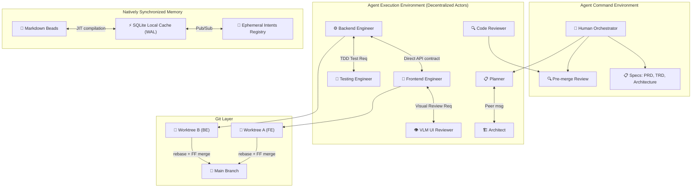
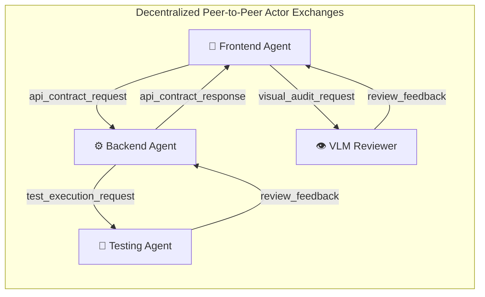
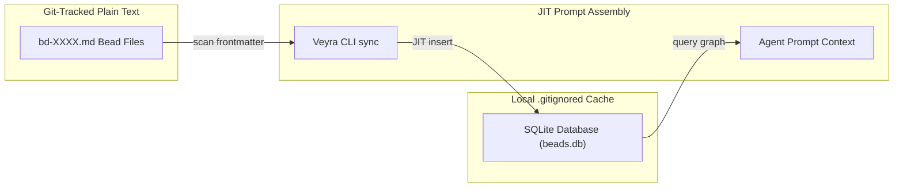

# Architecture — Veyra

**Version:** 2.0
**Status:** Living Document
**Last Updated:** 2026-05-25

---

## 1. System Topology

The Veyra architecture consists of two cooperative environments: the **Agent Command Environment (ACE)** where specs are maintained, and the **Agent Execution Environment (AEE)** where decentralized agents choreograph and execute code inside isolated Git worktrees.

**Plain-text summary:** Human Orchestrator defines specs and reviews results. The Orchestration Layer sets up the task registry. Specialized agents (Planner, Architect, Backend, Frontend, VLM UI Reviewer, Tester, Reviewer) execute JIT workflows. Agents collaborate directly via Actor Model peer-to-peer messaging using local inboxes (`memory/inbox/`). Developer agents write tests first (TDD loops), publish intents to a continuous broadcasting bus (`memory/intents/`) to verify semantic safety, and trigger responsive layout captures (`bin/visual-review.js`) for Vision-Language Model reviews before merging to main via rebase and fast-forward merges.

---

## 2. Agent Interaction Model (Choreography over Orchestration)

Instead of a centralized hub-and-spoke model where all subagent statuses route through a single orchestrator (creating an ultimate context bottleneck), Veyra implements **Actor-based Choreography**. 

Agents read and write directly to each other's local mailboxes (`memory/inbox/msg-*.json`) using predefined contract, testing, and layout audit schemas.

### Direct Messaging Protocols:
1. **API Negotiation**: Frontend agent sends a request directly to the backend agent to design payload structures before either writes logic.
2. **JIT Testing**: Developers request specific code test passes directly from the testing agent, bypassing the orchestrator entirely.
3. **Visual Audit**: Frontend engineers request responsive viewport reviews from the VLM UI Reviewer upon compiling mockups.

---

## 3. Natively Tracked Memory Flow

Veyra uses plain-text Markdown beads (`memory/beads/bd-XXXX.md`) for Git storage, maintaining text-based readability and conflict-free merging. The Veyra CLI automatically parses and indexes these beads JIT into a local SQLite database cache (`beads.db`) that is gitignored to prevent binary merge conflicts.

---

## 4. Epic Merge Strategy & Intent Broadcasting

To completely eliminate semantic conflict loops (where branches compile successfully individually but fail when merged due to columns or endpoints being renamed), agents use **Continuous Context Broadcasting (Intents)**.

1. **Broadcasting**: Before writing code in their isolated Git worktree, the agent publishes its implementation intentions (`veyra intent publish`) listing files, API routes, database fields, and CSS elements they plan to touch.
2. **Conflict Checking**: The agent runs `veyra intent check`. The system cross-references all broadcasted active peer intents and returns JIT alerts for overlapping schemas or contracts.
3. **Adaptation**: The agent adapts their implementation JIT *before* writing code, avoiding rebase loops.
4. **Fast-Forward Merge**: Merges are executed concurrently via optimistic fast-forwarding, clearing ephemeral intent records from SQLite upon branch termination.
