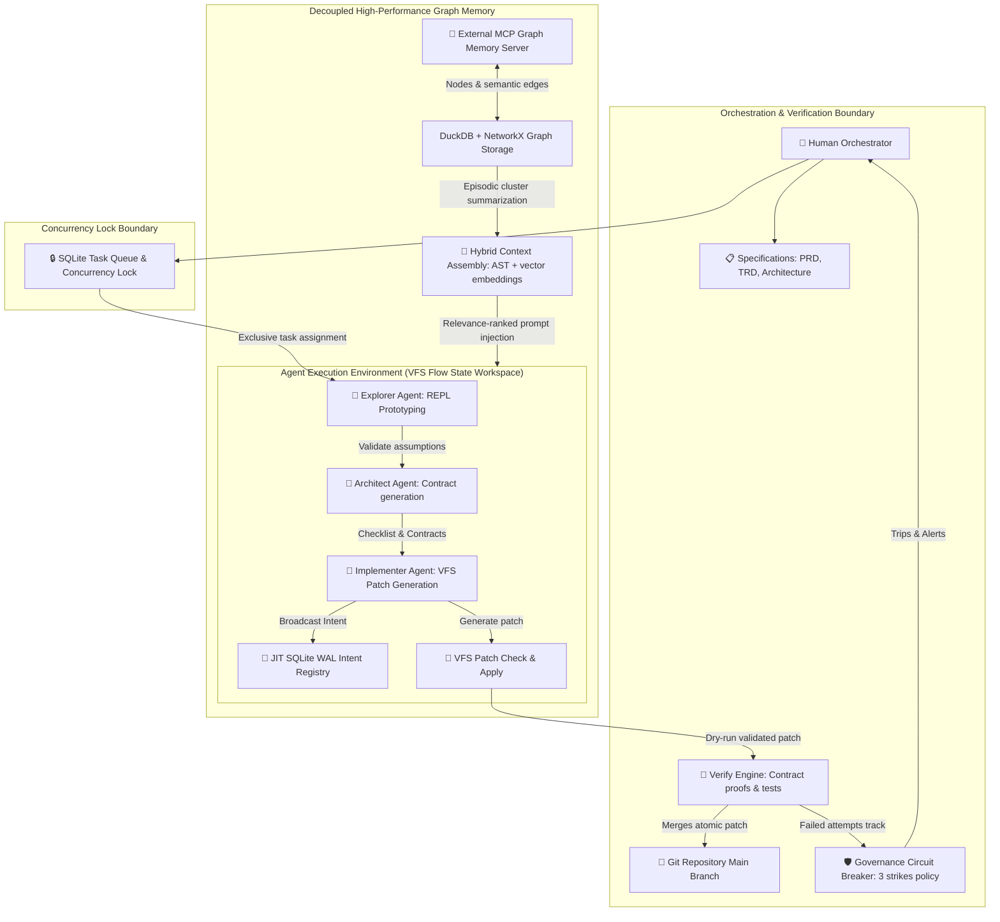

# Architecture — Veyra

**Version:** 3.0
**Status:** Living Document
**Last Updated:** 2026-05-26

---

## 1. System Topology

The Veyra V3 architecture comprises a decentralized **AI-Native Flow State & Contract-Proven OS** operating layer. It resolves multi-agent coordination locks, infinite loops, and semantic conflicts through a decoupled control plane, external graph memory, and isolated integration verifications.

**Plain-text summary:** The Human Orchestrator defines requirements. The Veyra engine uses a **Dual Explorer-Architect Loop** to eliminate rigid waterfall planning. An *Explorer* agent rapidly prototypes in an isolated playground. The *Architect* agent translates these learnings into concrete programmatic and mathematical **Contracts** (`checklists/contract-XXXX.json`). The *Implementer* agent writes the logic in a unified single branch utilizing the **VFS Patch System** (`bin/patch.js`). The **Verify Engine** (`bin/verify.js`) checks patches against the contract using automated test suites before commits. All agents claim their tasks from a centralized SQLite-based **Task Queue & Concurrency Lock** (`bin/db.js`) to prevent dual-agent race conditions or overlapping writes. All agents publish active plans to the JIT SQLite intent registry to intercept styling or logic collisions. An external **MCP Graph Memory Server** backed by DuckDB + NetworkX stores episodic context, which is dynamically summarized (compressed) to stay under context limits. If a task fails verification repeatedly, the **Governance State-Machine Circuit Breaker** (`bin/governance.js`) trips at 3 failures, halting execution and auto-escalating to the human.

---

## 2. Agent Interaction & Choreography Protocol

Veyra V3 implements **Actor-based Choreography** combined with strict safety and prototyping loops.

### Dual Explorer-Architect Loop
1. **Hypothesis Validation:** Instead of writing complex specs blind, the *Explorer* agent works directly in a sandboxed REPL to investigate tools, APIs, and file structures.
2. **Contract Synthesis:** The *Architect* reviews these REPL outputs and defines a `contract-XXXX.json` containing programmatic constraints, ensuring the team works against validated constraints.

### Universal Governance Circuit Breaker
Every cross-agent transaction is monitored by `bin/governance.js`. If the *Implementer* and *Testing* agents trigger repeated compiler, styling, or unit-test failures:
- The cycle counter is incremented.
- At **3 failed attempts**, the circuit breaker trips.
- The VFS patch state is preserved, and a detailed diagnostic bundle (diffs, stack traces, and communication histories) is dispatched directly to the human developer, preventing infinite token spend loops.

### Task Queue & Claim Locking
Before performing any task (bead) operations, agents must atomically lease-lock the bead in the centralized SQLite queue to guarantee exclusive worker processing:
- **Optimistic Locking:** Claim requests use atomic SQLite queries enforcing `claimed_by IS NULL` to prevent overlapping assignments.
- **JIT JSON Sync:** Lock transitions write to the SQLite database and immediately update the JSON memory bead file, which is validated JIT using a strict Zod schema.
- **Stale Cleanups:** A 30-minute stale-lease sweeping algorithm executes on subsequent claim requests to automatically recover from crashed or stalled worker processes.

---

## 3. Decoupled Memory & Hybrid Context Assembly

To scale memory to extremely large codebases without blowing out token budgets:
- **MCP memory server:** Operates an isolated Model Context Protocol service.
- **Graph Clustering (NetworkX):** Identifies closely related historical decisions, requirements, and tasks as graph clusters.
- **Episodic Compression:** Merges and summarizes older, closed clusters into single semantic nodes, delivering lightweight dense historical contexts to active agents.
- **Hybrid Context assembly:** Merges syntax-tree (AST) crawler paths for immediate caller-callee scopes with a fast vector embedding database (RAG) search for global configurations and styled elements.

---

## 4. Contract-Proven VFS Patches

- **Intent Registry:** Agents broadcast planned files, styling tokens, database columns, and endpoints to SQLite WAL cache.
- **Formal Verification:** Proposed unified patch files (`patch.js`) are checked by the `verify.js` engine, running precise linters, TypeScript compilations, and Vitest test suites.
- **Atomic Commits:** Patch is applied to the physical directory *only* after satisfying all contract proofs, keeping the main branch consistently green.
