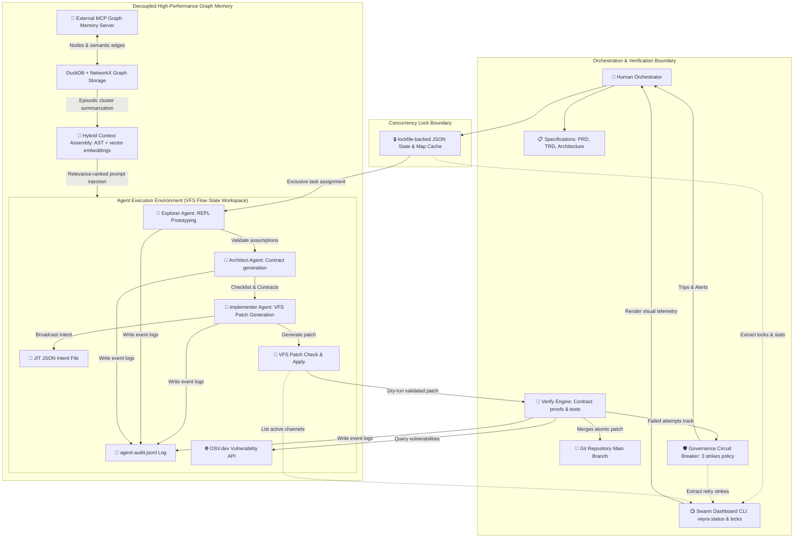
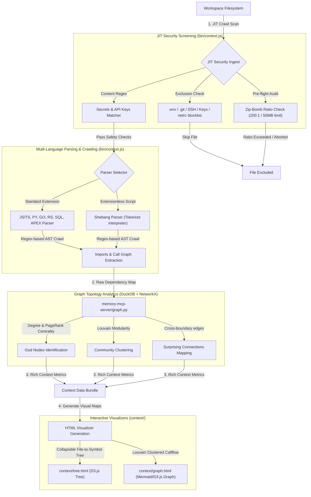
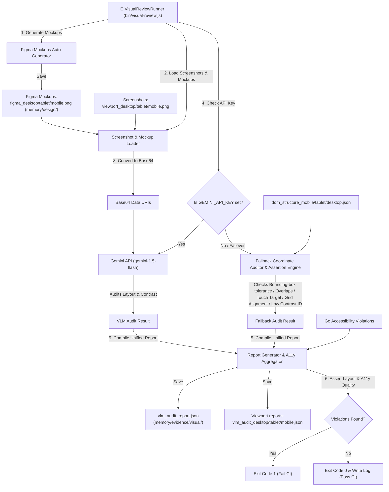

# Architecture — Veyra

**Version:** 4.0
**Status:** Living Document
**Last Updated:** 2026-06-16

---

## 1. System Topology

The Veyra V4 architecture comprises a decentralized **AI-Native Flow State & Contract-Proven OS** operating layer. It resolves multi-agent coordination locks, infinite loops, and semantic conflicts through a decoupled control plane, external graph memory, and isolated integration verifications, executing with zero native binary database dependencies.

**Plain-text summary:** The Human Orchestrator defines requirements. The Veyra engine uses a **Dual Explorer-Architect Loop** to eliminate rigid waterfall planning. An *Explorer* agent rapidly prototypes in an isolated playground. The *Architect* agent translates these learnings into concrete programmatic and mathematical **Contracts** (`checklists/contract-XXXX.json`). The *Implementer* agent writes the logic in a unified single branch utilizing the **VFS Patch System** (`bin/patch.js`). The **Verify Engine** (`bin/verify.js`) checks patches against the contract using automated test suites before commits. All agents claim their tasks from a decentralized, lockfile-backed **JSON Task Queue & Map Cache** (`bin/db.js`) to prevent dual-agent race conditions or overlapping writes. All agents publish active plans to the JIT JSON intent registry to intercept styling or logic collisions. An external **MCP Graph Memory Server** backed by DuckDB + NetworkX stores episodic context, which is dynamically summarized (compressed) to stay under context limits. If a task fails verification repeatedly, the **Governance State-Machine Circuit Breaker** (`bin/governance.js`) trips at 3 failures, halting execution and auto-escalating to the human.
A central **Swarm Status Dashboard** (`bin/dashboard.js`) and dynamic `veyra status` command tap into the JSON state files (`beads.json`, `event_bus.json`), governance storage dir, and patches directory to render a live visual telemetry control plane and structured JSON output back to the human developer. Agent executions are audited via structured, append-only logging to `agent-audit.jsonl`, and dependencies are verified against the external OSV.dev registry.

---

## 2. Agent Interaction & Choreography Protocol

Veyra V4 implements **Actor-based Choreography** combined with strict safety and prototyping loops.

### Dual Explorer-Architect Loop
1. **Hypothesis Validation:** Instead of writing complex specs blind, the *Explorer* agent works directly in a sandboxed REPL to investigate tools, APIs, and file structures.
2. **Contract Synthesis:** The *Architect* reviews these REPL outputs and defines a `contract-XXXX.json` containing programmatic constraints, ensuring the team works against validated constraints.

### Universal Governance Circuit Breaker
Every cross-agent transaction is monitored by `bin/governance.js`. If the *Implementer* and *Testing* agents trigger repeated compiler, styling, or unit-test failures:
- The cycle counter is incremented.
- At **3 failed attempts**, the circuit breaker trips.
- The VFS patch state is preserved, and a detailed diagnostic bundle (diffs, stack traces, and communication histories) is dispatched directly to the human developer, preventing infinite token spend loops.

### Task Queue & Claim Locking
Before performing any task (bead) operations, agents must atomically lease-lock the bead using a filesystem lockfile to guarantee exclusive worker processing:
- **Optimistic Locking:** Claim requests use lockfiles to synchronize reads and updates, verifying that the `claimed_by` field is null before writing.
- **JIT JSON Sync:** Lock transitions modify the in-memory Map cache and immediately write updates to the JSON bead file, which is validated JIT using a strict Zod schema.
- **Stale Cleanups:** A 30-minute stale-lease sweeping algorithm executes on subsequent claim requests to automatically recover from crashed or stalled worker processes.

---

## 3. Decoupled Memory & Hybrid Context Assembly

To scale memory to extremely large codebases without blowing out token budgets:
- **MCP memory server:** Operates an isolated Model Context Protocol service.
- **Graph Clustering (NetworkX):** Identifies closely related historical decisions, requirements, and tasks as graph clusters.
- **Episodic Compression:** Merges and summarizes older, closed clusters into single semantic nodes, delivering lightweight dense historical contexts to active agents.
- **Hybrid Context assembly:** Merges syntax-tree (AST) crawler paths for immediate caller-callee scopes with a fast vector embedding database (RAG) search for global configurations and styled elements.
- **File Watcher & JIT Cache Invalidation:** The Rust file watcher actor notifies the coordinator of changed or deleted files, writing pending event records to the JSON event bus. The context assembler JIT processes these events, clears corresponding entries from the crawl cache, and invalidates in-memory mtime/bead caches, guaranteeing cache freshness before graph evaluation.
- **ONNX Embeddings:** Generates 384-dimensional semantic embeddings in Rust (via tokenizers/ort) and retrieves them via Python `vector_search.py` using cosine similarity, falling back to TF-IDF if dependencies or databases are missing.

---

## 4. Contract-Proven VFS Patches

- **Intent Registry:** Agents broadcast planned files, styling tokens, database columns, and endpoints to the lockfile-backed JSON intent file.
- **Formal Verification:** Proposed unified patch files (`patch.js`) are checked by the `verify.js` engine, running precise linters, TypeScript compilations, and Vitest test suites.
- **Atomic Commits:** Patch is applied to the physical directory *only* after satisfying all contract proofs, keeping the main branch consistently green.
- **AI-Native Debugging Bridge:** When a verification step fails, the `verify.js` engine hooks the failure, extracts the stderr trace, parses it to resolve file coordinates, uses the Microsoft TypeScript AST compiler API to locate the deepest failing AST node, and exports a gzipped diagnostic report to `memory/evidence/kernel_panic_report.json.gz`.

---

## 5. Swarm Telemetry & Observability Layer

To monitor parallel executions and manage circuit breakers:
- **Telemetry Aggregator (`bin/dashboard.js`):** Extends visual primitives from `bin/ui.js` to compile JSON lockfile states, active concurrency locks, governance strikes, and directory-based patch channels.
- **Visual Primitives Mapping:**
  - Task status summaries and progress are wrapped inside cyan double-bordered `drawBox` modules.
  - Active concurrency locks are formatted inside a blue table (`drawTable`), demonstrating agent ownership, claim status, and holds duration.
  - Governance transaction streams display current strike counts against thresholds (`X/3`), coloring `tripped` breakers in bright red ANSI style.
  - Channels are parsed straight from the filesystem `patches/` folder and listed as active workspaces.

---

## 6. Graphify Enrichment Core & Security

The Graphify Enrichment Core integrates security, multi-language intelligence, graph theory metrics, and rich browser visualizers.

### Component Interaction Flow

### Component Details
- **JIT Input Security Screening:** The hybrid context plane (`bin/context.js`) filters all files through an `isSensitive` block to skip credential repositories, NETRC files, and private keys. Compressed zip/XML archives are audited pre-decompression to block zip-bombs exceeding a 200:1 ratio.
- **Multi-Language Parsing & shebang Handling:** Handles JS/TS, Python, Go, Rust, SQL, and Apex. Extensionless scripts are evaluated by reading the shebang line to identify the underlying engine runtime (Python, Node, Bash).
- **Modularity Modifiers & NetworkX Analytics:** The memory graph (`memory-mcp-server/graph.py`) calculates NetworkX degree centrality to isolate "God Nodes", and maps "Surprising Connections" by looking for edges that cross Louvain community boundaries or language family limits (e.g., Python connecting to Rust via binary bindings).
- **Interactive Browser Maps:** Dynamically outputs interactive visualizations:
  - `context/tree.html`: A collapsible hierarchical D3.js visualization presenting files and their symbols.
  - `context/graph.html`: A self-contained Mermaid.js architecture flow visualization showing community-grouped module interactions.

## 7. AST Code-as-a-Graph Expansion (Milestone 21)
The system enforces semantic integrity by replacing line-based text transformations with AST node manipulations.
- **Synthesized AST Nodes:** When code modification is requested, `bin/ast_transform.js` parses the target file as `ts.ScriptKind.TSX`, traverses it using TypeScript Compiler API visitors, constructs or updates target syntax nodes (classes, decorators, methods, JSX elements, interfaces, types), strips positions via recursive coordinate removal, and prints the result.
- **Semantic Conflict Detection:** `bin/patch.js` computes semantic keys (e.g., `class:ClassName`, `jsx-element:Tag:Attr`) for active patches, which are checked for overlap against concurrently executing tasks to prevent conflict merges before verification.

## 8. Multimodal VLM Layout Auditing (Milestone 22)
The visual review system (`bin/visual-review.js`) provides automated, responsive layout validation using vision-language models (VLMs) and fallback local validation engines.

### Data Flow Diagram

### Component Details
- **Figma Mockup Auto-Generator:** Automatically checks if Figma design mockups (`figma_desktop.png`, `figma_tablet.png`, and `figma_mobile.png`) exist in `memory/design/`. If missing, it dynamically generates placeholder images to ensure consistent comparison data is available.
- **Base64 Responsive Loader:** Reads the captured responsive screenshots (`viewport_desktop.png`, `viewport_tablet.png`, `viewport_mobile.png`) alongside the Figma mockups and encodes them into base64 format for payload transport.
- **Gemini API Integration:** When a `GEMINI_API_KEY` is present, screenshots and mockups are transmitted to the `gemini-1.5-flash` model with visual layout and contrast check instructions.
- **Deterministic Geometric Assertion Engine:** Executes local fallback layout assertions. It loads `checklists/figma-layout.json` to verify bounding boxes of key layout elements (`header`, `sidebar`, `main-content`, `submit-btn`) against specified coordinate tolerances; runs overlap/collision checks between sibling elements (excluding nested parent-child elements via coordinate containment); verifies mobile touch targets (>= 44x44px for interactive elements); and validates baseline grid alignment (checking positions and paddings as multiples of 4px).
- **A11y & CI Assertions Aggregator:** Removes early exits during accessibility audits, combining Go accessibility violations with Node local layout/VLM violations. Compiles the master report `memory/evidence/visual/vlm_audit_report.json` and viewport breakdown files. If any high or critical violations exist, it exits with `exit 1` to fail CI, otherwise writing `audit_summary.log` and exiting cleanly (`exit 0`).

## 9. Concurrency & JSON File Locking (Milestone 23)
To ensure write-safety across concurrent agent executions, the database engine implements file-level locking:
1. **Pre-flight Existence Assurance:** Ensures parent directory and the JSON target file exist before locking (writing `{}` if missing), as `proper-lockfile` mandates an existing target path.
2. **Synchronous Locking Wrapper:** Calls `lockSync` with retries: `lockfile.lockSync(jsonPath, { retries: { retries: 10, minTimeout: 50, maxTimeout: 100 } })`. To support synchronous retries which are natively rejected by the library, `proper-lockfile` is monkeypatched to implement a synchronous spin retry loop with randomized backoff.
3. **Atomic Write & Clean Release:** Enforces read, merge, validate, and write operations inside a try/finally block, ensuring the lock is released even if schema validation or write operations fail.

## 10. Sandboxed Patch Verification (Milestone 24)
To ensure multi-agent patch concurrent safety and prevent workspace corruption, patch verification is conducted in an isolated temporary sandbox before modifications are permanently written to the main project:
1. **Speculative Workspace Replication:** When `commit()` executes, if an active task has a checklist contract file, a new temporary directory `sandboxDir` is created in the system temp directory, and the workspace is recursively copied (excluding dependency, build, and telemetry caches such as `node_modules`, `.git`, `.agents`, `patches`, `scratch`, `target`, `__pycache__`, and `.pytest_cache`).
2. **Directory Junction Mounting:** To avoid expensive package installs inside the sandbox, a directory junction for `node_modules` is linked from the main project into `sandboxDir` via standard Windows directory junction symlinking.
3. **Sandbox Validation:** Memory-modified files from `virtualCache` are written directly to their corresponding paths inside `sandboxDir`, and `verifyContract(contractPath, null, sandboxDir)` is executed to perform rules and formal proof validations against the sandbox files.
4. **Isolation Guard & Clean Revert:** If sandbox validation fails, writing to the main workspace is blocked, no rollback is executed on main files, and the `sandboxDir` is unlinked and deleted in a try-finally block. Only upon successful verification are the files permanently written to the main workspace.

---

## 10.5 Pub/Sub Swarm Worker Loop (Milestone 18)
Decoupled multi-agent execution relies on asynchronous pub/sub worker coordination:
1. **JIT Event Ingestion:** Status changes on beads triggers event publishing inside `bin/db.js` using dynamic imports of `bin/event_bus.js` (avoiding circular dependency locks). These events (e.g. `bead_created`, `bead_status_changed`, `bead_resolved`, `bead_failed`) are recorded under lockfile to the JSON event bus.
2. **Daemon Polling Loop:** A background microservice (`bin/daemon.js`) polls the JSON event bus every 500ms, subscribing to topics to mark them completed.
3. **Dependency Cascading:** Tracks dependencies of open/failed beads. When a dependency fails, the failure cascades downstream to dependents. If all parent dependencies are resolved, the daemon routes/allocates the task to the primary role via `bin/router.js` and publishes `task_allocated`.
4. **Startup Sweep & CLI Integration:** Boot time runs a sweep to recover stale tasks. Background execution is managed via CLI (`daemon start [--background]`, `daemon stop`, `daemon status`, `daemon run`).

---

## 10.6 Model Context Protocol (MCP) Server CLI Integration
External LLMs and workflows communicate with Veyra's task database using a standard Model Context Protocol (MCP) interface over standard I/O (stdio):
1. **JSON-RPC Protocol Layer:** Line-delimited JSON-RPC 2.0 messages are read from stdin and written to stdout, handling requests and ignoring notifications silently.
2. **Tool Execution Dispatcher:** When the client requests `tools/call`, the dispatcher maps the tool name to database operations (calling `beadsDB.sync()`, `beadsDB.getAll()`, `beadsDB.create()`, or `beadsDB._writeToJSON()`) and returns standard MCP output formats.
3. **CLI Bootstrapping:** Binds to the command `node bin/veyra.js mcp` to start the server in the foreground.

---

## 11. Architectural Decision Records (ADRs)

The architectural structure of Veyra V4 is officially guided by the following Architectural Decision Records:

- **[ADR 0001: Deprecate Legacy Git Worktrees in Favor of VFS Patching](docs/adr/0001-deprecate-legacy-git-worktrees.md)**: Transitioning from sequential Git worktrees to the line and AST-based VFS patch engine (`patch.js`) to eliminate merge chaos and locking overhead.
- **[ADR 0002: Prevent JSON Database Concurrency Collisions Using proper-lockfile](docs/adr/0002-prevent-concurrency-collision-via-proper-lockfile.md)**: Using `proper-lockfile` with a synchronous retry spin-lock mechanism to safeguard JSON write integrity.
- **[ADR 0003: Isolated Sandboxed Patch Verification](docs/adr/0003-isolated-sandboxed-patch-verification.md)**: Copying speculative workspace to temp directories, linking `node_modules` via junctions, and verifying patches programmatically in isolation.
- **[ADR 0004: SQLite-Backed Incremental Crawl Cache](docs/adr/0004-sqlite-backed-incremental-crawl-cache.md)**: Caching import structures and semantic keys inside a `crawl_cache` table in `beads.db` using file modification time (`mtime`) flags to optimize crawler speed.
- **[ADR 0005: Rust File Watcher Events & ONNX Semantic Search Integration](docs/adr/0005-file-watcher-events-and-onnx-semantic-search.md)**: Connecting Rust file watcher events (`agent_events`) with Python ONNX similarity search (`vector_search.py`) for semantic relevance and JIT cache invalidation.
- **[ADR 0006: Pub/Sub Swarm Worker Loop](docs/adr/0006-pubsub-swarm-worker.md)**: Employs background worker daemon polling SQLite WAL event bus, managing async routing/allocation and failure propagation.

All V4 upgrades are fully complete, robust, and verified.

