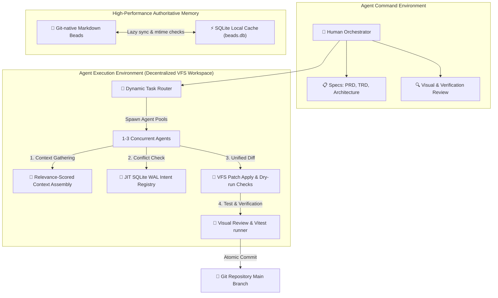

# Architecture — Veyra

**Version:** 2.1
**Status:** Living Document
**Last Updated:** 2026-05-26

---

## 1. System Topology

The Veyra V2 architecture comprises a unified developer command layer utilizing a decentralized **Actor Choreography Model** integrated with an ultra-fast **Virtual Filesystem (VFS) Patch Workspace** rather than expensive and conflict-prone Git worktree environments.

**Plain-text summary:** Human Orchestrator defines specs and goals. The Veyra CLI automatically Classifies tasks using a **Dynamic Router** (`bin/router.js`), assigning optimized teams of 1 to 3 concurrent agents. Instead of spawning multiple virtual OS worktrees, agents collaborate directly in a virtual workspace layer using a line-based **VFS Patch System** (`bin/patch.js`). Agents broadcast active code intentions (files, routes, DB columns, CSS classes) JIT to a high-concurrency **SQLite WAL Intent Registry** (`bin/intent.js`) to detect semantic conflicts. Developers compile modifications, run visual audits (`bin/visual-review.js`), and commit changes atomically.

---

## 2. Agent Interaction & Choreography Protocol

Veyra implements **Actor-based Choreography** rather than centralized hub-and-spoke orchestration, preventing single-agent context bottlenecks. 

### P2P Local Mailboxes (`memory/inbox/`)
Agents write structured JSON messages directly to peer inboxes to coordinate tasks JIT:
1. **API Contracts**: Frontend agents message backend agents to negotiate endpoints and payloads before writing logic.
2. **Visual Audits**: Developers trigger visual layout screenshot renders across viewports for evaluation.
3. **Continuous Testing**: Agents coordinate test executions automatically inside the unified VFS patch environment.

---

## 3. High-Performance Authoritative Memory & Context Assembly

Authoritative state is kept version-controlled in plain-text Markdown beads (`memory/beads/*.md`). To eliminate query overhead, Veyra synchronizes these beads into a local `.gitignored` SQLite cache (`beads.db`).

### Optimization Details:
- **Dirty-flag Caching:** The Veyra engine checks file modification times (`mtime`) using Node fs. It only parses modified beads, reducing disk I/O significantly.
- **Relevance Scoring:** Token allocation is calculated based on:
  1. **Keyword Overlap:** Matching search patterns in files.
  2. **Import Graph Proximity:** Distance from target file in AST.
  3. **Semantic Tags:** Overlap in REST endpoints, styled selectors, and DB schemas.
  This completely avoids OOM failures by discarding irrelevant files when the context budget is exceeded.

---

## 4. Virtual Filesystem (VFS) Patch & Intent Broadcasting

To resolve parallel agent conflicts without Git worktree rebase loops:
1. **Intent Broadcast (`veyra intent publish`):** Agents write their planned code touchpoints to the SQLite WAL DB.
2. **Overlap Check (`veyra intent check`):** If multiple agents plan to edit the same file, style, or API endpoint, a semantic conflict warning is raised instantly.
3. **Patch Generation (`veyra patch check/apply`):** Code changes are formatted as standard line-based unified diffs. The patch engine dry-runs the changes against the workspace to identify line collisions, applying changes atomically only when clean.
