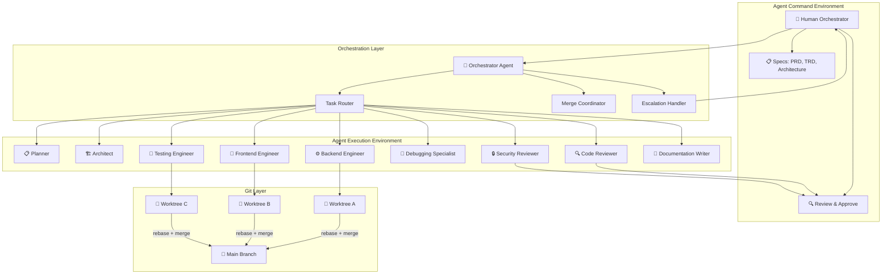
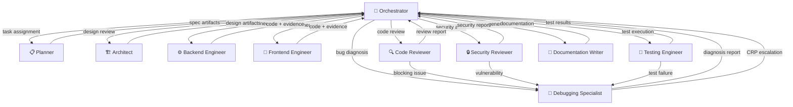
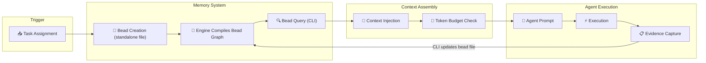
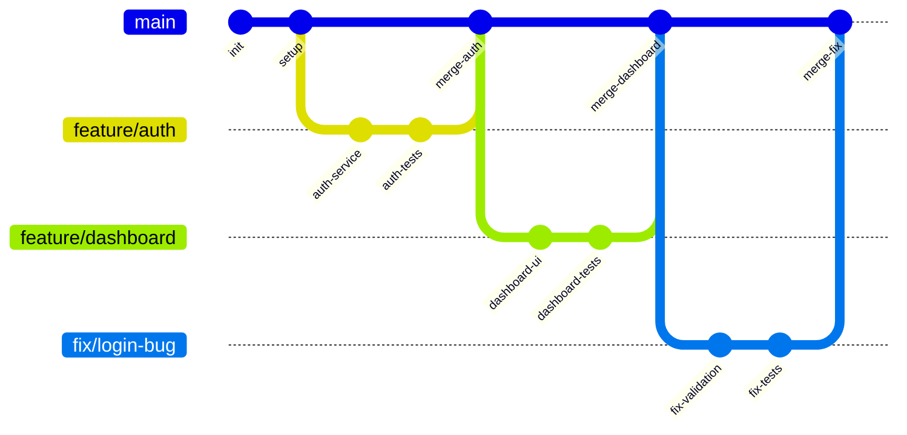
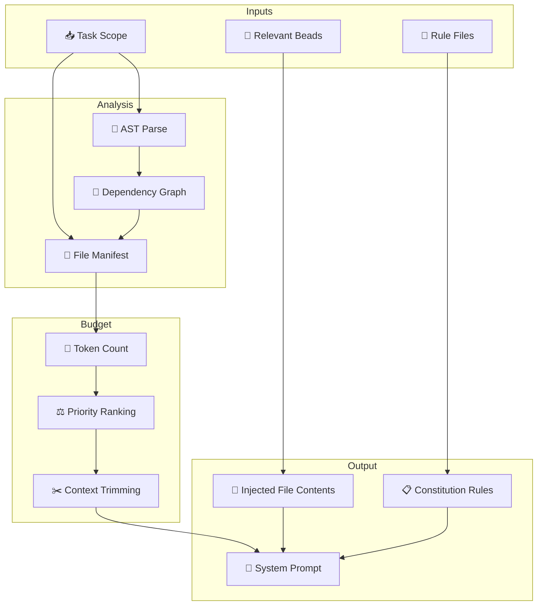
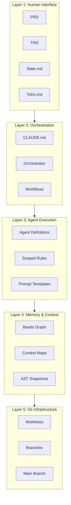

# Architecture — Veyra

**Version:** 1.0
**Status:** Living Document
**Last Updated:** 2025-05-24

---

## 1. System Topology

The system has two operating modes: the **Agent Command Environment (ACE)** where humans define specs and review results, and the **Agent Execution Environment (AEE)** where agents write code in isolated worktrees.

**Plain-text summary:** Human Orchestrator defines specs and reviews results. The Orchestration Layer (Orchestrator, Task Router, Merge Coordinator, Escalation Handler) routes tasks to 9 specialized agents: Planner, Architect, Backend Engineer, Frontend Engineer, Code Reviewer, Debugging Specialist, Testing Engineer, Security Reviewer, and Documentation Writer. Each engineering agent works in an isolated Git worktree. Worktrees integrate into main via rebase + merge. Code Reviewer and Security Reviewer feed back to the human Review stage. Unresolvable issues escalate from the Escalation Handler to the Human Orchestrator.

---

## 2. Agent Interaction Model

Agents do not communicate directly with each other. All coordination flows through the **Orchestrator**. Agents produce artifacts; the Orchestrator routes those artifacts to the next agent in the workflow.

**Plain-text summary:** All agents communicate exclusively through the Orchestrator — no direct agent-to-agent channels. The Orchestrator sends task assignments (planning, design review, implementation, test execution, code review, security audit, bug diagnosis, docs generation) and agents return artifacts (spec artifacts, design artifacts, code + evidence, test results, review reports, security reports, diagnosis reports, documentation). Escalation path: Code Reviewer / Security Reviewer / Testing Engineer → Debugging Specialist → Orchestrator (CRP escalation to human).

**Escalation paths:**
- Code Reviewer → Debugging Specialist (when review finds bugs)
- Security Reviewer → Debugging Specialist (when audit finds vulnerabilities)
- Testing Engineer → Debugging Specialist (when tests fail)
- Debugging Specialist → Orchestrator (when 3+ patches fail — CRP escalation to human)

---

## 3. Memory Flow

The Beads memory system forms a directed graph. Every task, decision, and bug is a node stored as a standalone JSON file in `memory/beads/*.json`. Edges represent relationships (dependencies, supersedes). The Veyra CLI Engine dynamically compiles these decentralized nodes into a unified, queryable in-memory graph to assemble task contexts for agents.

**Plain-text summary:** Task assignment → bead creation (standalone JSON file under `memory/beads/`) → engine compiles bead graph → CLI queries related beads for context → context injection → token budget check → agent prompt → execution → evidence capture → CLI updates bead file (cycle repeats). Old beads are marked `superseded_by` when decisions change.

 
**Bead lifecycle:**
1. Task is assigned → CLI creates decentralized `task` bead file under `memory/beads/bd-XXXX.json` with `status: open`.
2. Agent runs CLI query to search related beads for context (prior decisions, related bugs).
3. Context is assembled from parsed bead dependencies + file manifests.
4. Agent executes and produces evidence.
5. CLI updates the bead file: `status: resolved`, `evidence: <link>`.
6. If a decision changes, CLI marks the old bead file with `superseded_by: <new-bead-id>`.

---

## 4. Merge Strategy

All agents work in isolated Git worktrees. Merges into main are **strictly sequential** — no parallel merges, no merge commits. Every integration is a fast-forward after rebase.

**Plain-text summary:** Merges are strictly sequential — no parallel merges, no merge commits. Flow: Agent completes work in worktree → tests pass (evidence captured) → Code Reviewer + Security Reviewer approve → `git rebase main` → fast-forward merge into main → remove worktree → update bead to resolved. On conflict: agent retries resolution up to 2 times; on 3rd failure, a CRP is created and escalated to the human orchestrator.

**Merge protocol:**
1. Agent completes work in worktree
2. Tests pass in worktree (execution evidence captured)
3. Code reviewer + security reviewer approve
4. `git rebase main` in worktree branch
5. `git checkout main && git merge <branch>` (fast-forward)
6. `git worktree remove <path>`
7. Update beads: task → resolved

**Conflict resolution:**
- If rebase produces conflicts, the agent attempts resolution (up to 2 tries)
- On 3rd failure, a CRP is created and escalated to the human orchestrator
- The human resolves conflicts and the agent continues from the resolved state

---

## 5. Context Assembly Pipeline

Agents receive **deterministic context** — not RAG search results. The pipeline assembles exactly the files an agent needs based on the task scope.

**Plain-text summary:** Pipeline: Task Scope → AST Parse (syntax tree with function/class boundaries) → Dependency Graph (module import/export map) → File Manifest (ordered file paths). In parallel: Rule Files → Constitution Rules; Relevant Beads → Injected Context. File Manifest feeds Token Count → Priority Ranking → Context Trimming. All streams converge into the final System Prompt. Result: agents receive deterministic context — exactly the files they need, nothing they don't.

**Pipeline steps:**

| Step | Input | Output | Purpose |
|---|---|---|---|
| **AST Parse** | Source files in task scope | Syntax tree with function/class boundaries | Understand code structure without reading every line |
| **Dependency Graph** | AST output | Module import/export map | Know which files are connected to the task |
| **File Manifest** | Dependency graph + task scope | Ordered list of file paths | Exact files the agent needs to read |
| **Token Count** | File manifest + file contents | Total token count | Verify context fits within agent limits |
| **Priority Ranking** | Token count + task relevance | Ranked file list | Most relevant files first |
| **Context Trimming** | Ranked files + token budget | Trimmed file list | Drop least relevant files if over budget |
| **System Prompt** | Trimmed files + rules + beads | Final agent prompt | Everything the agent needs, nothing it doesn't |

---

## 6. Layer Architecture

**Plain-text summary:** Five layers, top to bottom: Layer 1 (Human Interface) — PRD, TRD, State.md, ToDo.md: define what to build, review results, approve merges. Layer 2 (Orchestration) — CLAUDE.md, Orchestrator, Workflows: route tasks, coordinate agents, manage merge sequence. Layer 3 (Agent Execution) — Agent Definitions, Scoped Rules, Prompt Templates: write code, run tests, review code, fix bugs. Layer 4 (Memory & Context) — Beads Graph, Context Maps, AST Snapshots: persist decisions, assemble context, track state. Layer 5 (Git Infrastructure) — Worktrees, Branches, Main Branch: isolate work, version code, integrate changes.

**Layer responsibilities:**
- **Layer 1 (Human):** Define what to build. Review results. Approve merges.
- **Layer 2 (Orchestration):** Route tasks. Coordinate agents. Manage merge sequence.
- **Layer 3 (Execution):** Write code. Run tests. Review code. Fix bugs.
- **Layer 4 (Memory):** Persist decisions. Assemble context. Track state.
- **Layer 5 (Git):** Isolate work. Version code. Integrate changes.
