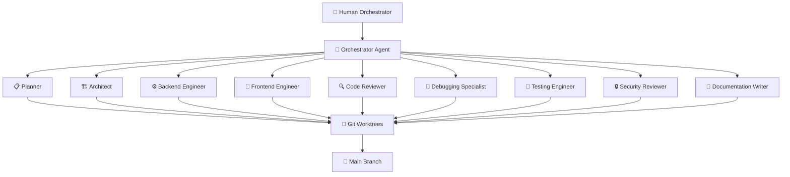

# ⚡ Veyra — AI-Native Engineering OS

> A reusable, production-grade repository framework for Antigravity-style multi-agent orchestration.

This repository is a **dual-modality workbench** serving both human overseers (**Agent Command Environment**) and autonomous agents (**Agent Execution Environment**). It provides structured, spec-driven development with deterministic AST context injection blended with constrained semantic scoring — no context rot. Every agent knows exactly what to read, what to write, and when to escalate.

---

## Architecture Overview



Each agent operates in an **isolated Git worktree**. Merges are sequential — rebase onto main before integrating. No shared branches. No merge chaos.

---

## Directory Structure

| Directory | Purpose |
|---|---|
| `agents/` | Agent-as-Code definitions — identity, capabilities, tool access, constraints |
| `rules/` | Directory-scoped engineering rules loaded on-demand by agents |
| `memory/` | Beads memory system — persistent JSON graph of decisions, bugs, tasks |
| `context/` | Deterministic context injection maps — AST snapshots, dependency graphs |
| `workflows/` | YAML workflow definitions for feature development, bug fixes, refactors |
| `prompts/` | Reusable prompt templates with variable injection points |
| `templates/` | Scaffolding templates for PRDs, TRDs, CRPs, and other documents |
| `debugging/` | Debugging playbooks, error taxonomies, and reproduction scripts |
| `checklists/` | Pre-merge, deployment, and review checklists |
| `docs/` | Human-facing documentation — guides, onboarding, glossary |
| `orchestration/` | Multi-agent coordination protocols and merge strategies |
| `governance/` | Decision records, escalation policies, agent authority boundaries |
| `standards/` | Code style guides, API conventions, naming standards |
| `.agent/skills/` | Antigravity skill definitions for specialized agent capabilities |

---

## Quick Start

```bash
# 1. Clone the repository
git clone https://github.com/veyra-os/veyra.git
cd veyra

# 2. Verify the beads memory system is initialized
cat memory/beads/bd-*.json

# 3. Read the agent constitution
cat CLAUDE.md

# 4. Start your first project by copying this framework
cp -r veyra/ my-project/
# Then customize CLAUDE.md, agents/, and workflows/ for your stack.
```

---

## Philosophy

### 1. Spec-Driven Development
Every feature starts with a spec (PRD → TRD → Architecture). Code is the **last** step, not the first. Agents receive structured specs, not vague instructions.

### 2. Deterministic Context Injection
Context is assembled from AST import graphs blended with constrained TF-IDF similarity scoring — scoped deterministic injection that reduces hallucination risk compared to open-ended RAG retrieval.

### 3. Beads Memory Pattern
Every decision, bug fix, and task state is recorded as a **Bead** — a Zod-validated JSON file (`memory/beads/bd-*.json`), JIT-synced to a local SQLite cache. Agents query beads for context instead of relying on ephemeral chat history. Memory survives session boundaries.

### 4. Phase-Gated Execution
Work proceeds through strict phases: **Spec → Plan → Implement → Test → Review → Merge**. No phase can be skipped. Each phase has explicit entry and exit criteria.

### 5. Git Worktree Isolation
Each agent operates in its own Git worktree. No two agents touch the same branch. Merges are sequential with mandatory rebase. This eliminates merge conflicts from parallel agent work.

---

## Anti-Patterns

These are **hard failures** in Veyra. If you see them, stop and fix the process.

| Anti-Pattern | Why It Fails |
|---|---|
| **Monolithic prompts (>200 lines)** | Agents lose coherence past ~150 instructions. Split into scoped rule files. |
| **Shared branches for parallel agents** | Guaranteed merge conflicts. Use one worktree per agent, one branch per task. |
| **Lossy RAG for code context** | RAG retrieves probabilistically. You need deterministic file-path injection for code. |
| **Speculative features** | Agents write minimum code for the spec. No "while I'm here" additions. |
| **Relying on chat history** | Chat history is ephemeral and truncated. Use Beads for persistent memory. |
| **Skipping execution evidence** | "It should work" is not evidence. Every change requires test output logs. |

---

## Repository Files

| File | Purpose |
|---|---|
| `CLAUDE.md` | Agent constitution — hard rules, stack, commands, coordination protocols |
| `PRD.md` | Product Requirements Document for Veyra itself |
| `TRD.md` | Technical Requirements Document — schemas, integrations, specs |
| `Architecture.md` | Living architecture with mermaid diagrams |
| `State.md` | Current project state — phase, active agents, workspace inventory |
| `ToDo.md` | Roadmap with milestones and task tracking |

---

## License

MIT License — see [LICENSE](LICENSE) for details.

---

## Maintainer

**Veyra OS Maintainers**

Built for engineers who treat AI agents as first-class team members, not autocomplete.
