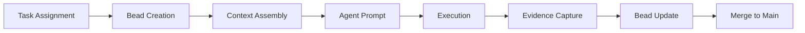

# Technical Requirements Document — Veyra

**Version:** 1.0
**Author:** VINYASGM
**Date:** 2025-05-24
**Status:** Active

---

## 1. Technical Stack

Veyra's core framework uses **zero runtime dependencies**. The entire operating system is composed of plain-text files interpreted by Git and AI agents.

| Technology | Role |
|---|---|
| **Git** | Version control, worktree isolation, branch-per-agent coordination |
| **Markdown** | Agent definitions, rules, specs, documentation, constitution |
| **JSON** | Beads memory system, context maps, configuration |
| **YAML** | Workflow definitions, agent capability manifests |

The **project stack** (defined per-project in `CLAUDE.md`) defaults to:
- Runtime: Node.js 20+ / TypeScript 5+
- Package Manager: pnpm
- Testing: Vitest
- Linting: ESLint + Prettier
- Database: PostgreSQL
- Framework: Next.js

These defaults are overridden when Veyra is cloned for a specific project.

---

## 2. Environment Requirements

| Requirement | Minimum |
|---|---|
| **Operating System** | Windows 10+, macOS 12+, Ubuntu 20.04+ |
| **Git** | 2.38+ (worktree support required) |
| **Text Editor / IDE** | Any — VS Code, Neovim, JetBrains, etc. |
| **AI Coding Agent** | Any agent that reads markdown files from the filesystem |
| **Shell** | PowerShell (Windows), bash/zsh (macOS/Linux) |
| **Node.js** | 20+ (for projects using the default stack) |
| **pnpm** | 8+ (for projects using the default stack) |

---

## 3. Core Schemas

### 3.1 Decentralized Bead JSON Schema (`memory/beads/bd-XXXX.json`)

Each bead is stored as an individual JSON file containing a single bead object. Beads are never deleted — only superseded by new beads.

```json
{
  "id": "bd-0002",
  "type": "architectural_decision | bug_discovery | task_state | incident | consensus | requirement",
  "status": "open | in_progress | resolved | blocked | archived",
  "title": "Short descriptive title",
  "description": "Detailed description of the decision, bug, or task",
  "dependencies": ["bd-0001"],
  "author": "agent-id | human-orchestrator",
  "timestamp": "2026-05-24T12:00:00Z",
  "tags": ["backend", "database", "migration"],
  "evidence": "Link to test output, Git hash, or execution logs",
  "superseded_by": null
}
```

**Field requirements:**
- `id` — Unique string identifier matching pattern `bd-XXXX` where XXXX is a 4-digit zero-padded integer.
- `type` — One of the standardized bead types.
- `status` — Current state of the bead.
- `dependencies` — Array of bead ID strings that this bead relates to.
- `superseded_by` — ID of the bead replacing this decision if it has been updated.
- `evidence` — Required for `resolved` status on tasks and bugs. Link to verification output.

### 3.2 Workflow YAML Schema (`workflows/*.yaml`)

```yaml
name: feature-development
description: Standard workflow for developing a new feature
version: "1.0"

phases:
  - name: spec
    description: Define requirements and technical design
    agents: [planner, architect]
    entry_criteria:
      - PRD exists and is approved
    exit_criteria:
      - TRD is written and reviewed
      - Architecture.md is updated
    artifacts:
      - PRD.md
      - TRD.md
      - Architecture.md

  - name: plan
    description: Create implementation plan with file-level scope
    agents: [planner]
    entry_criteria:
      - TRD is approved
    exit_criteria:
      - Implementation plan lists all files to create/modify
      - Test plan is defined
    artifacts:
      - implementation-plan.md

  - name: implement
    description: Write code in isolated worktree
    agents: [backend-engineer, frontend-engineer]
    entry_criteria:
      - Implementation plan is approved
      - Git worktree is created
    exit_criteria:
      - All planned files are created/modified
      - Code compiles without errors
    artifacts:
      - Source code files

  - name: test
    description: Write and run tests
    agents: [testing-engineer]
    entry_criteria:
      - Implementation is complete
    exit_criteria:
      - All tests pass
      - Coverage does not decrease
      - Execution evidence is captured
    artifacts:
      - Test files
      - test-output.log

  - name: review
    description: Code review and security audit
    agents: [code-reviewer, security-reviewer]
    entry_criteria:
      - Tests pass
    exit_criteria:
      - No blocking issues
      - Security checklist passes
    artifacts:
      - review-report.md

  - name: merge
    description: Rebase and merge into main
    agents: [orchestrator]
    entry_criteria:
      - Review approved
      - Tests pass on rebased branch
    exit_criteria:
      - Branch merged to main
      - Worktree cleaned up
      - Beads updated
    artifacts:
      - Merge commit
```

### 3.3 Agent Definition Markdown Schema (`agents/*.md`)

```markdown
# Agent: [Name]

## Identity
- **Role:** [e.g., Backend Engineer]
- **ID:** [e.g., backend-engineer]
- **Authority Level:** [executor | reviewer | orchestrator]

## Capabilities
- [Capability 1]
- [Capability 2]

## Tool Access
- [Tool 1: description]
- [Tool 2: description]

## Constraints
- [Hard constraint 1]
- [Hard constraint 2]

## Escalation Triggers
- [Condition that requires escalation]

## Output Format
- [Expected output structure]

## Rules to Load
- @rules/global.md
- @rules/[scope].md
```

---

## 4. Directory Structure

```
veyra/
├── .agent/
│   └── skills/              # Antigravity skill definitions
│       └── ui-ux-pro-max/   # UI/UX design intelligence skill
├── agents/                  # Agent-as-Code definitions
│   ├── orchestrator.md      # Orchestrator agent — task routing, merge coordination
│   ├── planner.md           # Planner agent — specs, implementation plans
│   ├── architect.md         # Architect agent — system design, boundary enforcement
│   ├── backend-engineer.md  # Backend engineer — API, services, database
│   ├── frontend-engineer.md # Frontend engineer — UI components, pages
│   ├── code-reviewer.md     # Code reviewer — quality, style, correctness
│   ├── debugging-specialist.md # Debugger — root cause analysis, reproduction
│   ├── testing-engineer.md  # Tester — test strategy, coverage, execution
│   ├── security-reviewer.md # Security — vulnerability analysis, hardening
│   └── documentation-writer.md # Docs — API docs, guides, changelogs
├── rules/                   # Directory-scoped engineering rules
│   ├── global.md            # Always-loaded rules for all agents
│   ├── frontend.md          # Frontend-specific rules (React, CSS, a11y)
│   ├── backend.md           # Backend-specific rules (API, DB, services)
│   ├── security.md          # Security rules (auth, input validation, secrets)
│   └── testing.md           # Testing rules (coverage, mocking, fixtures)
├── memory/                  # Persistent memory system
│   └── beads.json           # Append-only bead graph
├── context/                 # Deterministic context injection
│   ├── ast-maps/            # AST snapshots for codebase navigation
│   ├── dependency-graphs/   # Module dependency graphs
│   └── file-manifests/      # Scoped file lists for context assembly
├── workflows/               # YAML workflow definitions
│   ├── feature-development.yaml
│   ├── bug-fix.yaml
│   ├── refactor.yaml
│   └── security-patch.yaml
├── prompts/                 # Reusable prompt templates
│   ├── code-review.md
│   ├── bug-report.md
│   └── implementation-plan.md
├── templates/               # Document scaffolding templates
│   ├── prd-template.md
│   ├── trd-template.md
│   ├── crp-template.md      # Consultation Request Pack template
│   └── adr-template.md      # Architecture Decision Record template
├── debugging/               # Debugging playbooks
│   ├── error-taxonomy.md
│   ├── reproduction-guide.md
│   └── common-failures.md
├── checklists/              # Review and deployment checklists
│   ├── pre-merge.md
│   ├── deployment.md
│   └── security-audit.md
├── docs/                    # Human-facing documentation
│   ├── onboarding.md
│   ├── glossary.md
│   └── contributing.md
├── orchestration/           # Multi-agent coordination
│   ├── merge-strategy.md
│   ├── worktree-protocol.md
│   └── agent-routing.md
├── governance/              # Decision records and policies
│   ├── escalation-policy.md
│   ├── authority-matrix.md
│   └── decisions/           # Architecture Decision Records
├── standards/               # Code style and conventions
│   ├── api-conventions.md
│   ├── naming-standards.md
│   └── file-organization.md
├── .gitignore
├── CLAUDE.md                # Agent constitution (100-120 lines)
├── README.md                # Repository overview
├── PRD.md                   # Product Requirements Document
├── TRD.md                   # Technical Requirements Document (this file)
├── Architecture.md          # Living architecture document
├── State.md                 # Active project state
└── ToDo.md                  # Roadmap and milestones
```

---

## 5. Integration Points

### 5.1 Git Worktrees for Agent Isolation

Each agent receives its own Git worktree to prevent file conflicts:

```bash
# Create a worktree for backend-engineer working on feature-auth
git worktree add ../veyra-worktree-auth -b feature/auth

# Agent works in ../veyra-worktree-auth/
# When complete, rebase and merge:
git rebase main
git checkout main
git merge feature/auth
git worktree remove ../veyra-worktree-auth
```

**Rules:**
- One worktree per agent per task
- Branch naming: `feature/<task-slug>`, `fix/<bug-slug>`, `refactor/<scope>`
- Merges are sequential — never parallel
- Worktrees are cleaned up after merge

### 5.2 MCP Servers for Tool Access

Agents access external tools via MCP (Model Context Protocol) servers:

| MCP Server | Tools Provided |
|---|---|
| `firebase-mcp-server` | Firebase project management, deployment, security rules |
| `github-mcp-server` | Repository operations, PR management, code search |

Tool access is defined per-agent in `agents/*.md`. Not all agents have access to all tools.

### 5.3 Deterministic State Injection via Context Maps

Instead of RAG search, Veyra uses explicit context assembly:

```
1. AST Parse       → Generate syntax tree of relevant source files
2. Dependency Graph → Map imports/exports between modules
3. File Manifest    → List exact file paths the agent needs to read
4. Token Budget     → Verify total context fits within agent limits
5. System Prompt    → Inject file contents + rules into agent prompt
```

This pipeline produces **deterministic** context — the same inputs always produce the same agent prompt. No probabilistic retrieval, no "find similar" — just "read these files."

---

## 6. Data Flow



Every task creates a bead. Every bead informs context assembly. Every execution produces evidence. Every merge updates beads. The cycle is closed — nothing is lost.

---

## 7. Security Requirements

| Requirement | Implementation |
|---|---|
| No secrets in repository | `.gitignore` excludes `.env*`; CLAUDE.md hard-rule prohibits |
| Agent scope enforcement | Agents cannot modify files outside their assigned task scope |
| Review before merge | Code reviewer + security reviewer agents must approve |
| Audit trail | All decisions recorded as beads with timestamps and author IDs |
| Principle of least privilege | Tool access is per-agent, not global |
