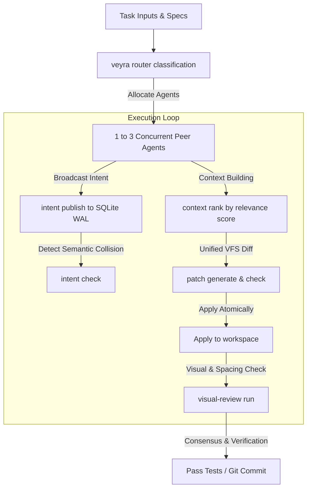

# Veyra OS V2 Context

Welcome to Veyra, the developer context hub. This document serves as the absolute source of truth for the codebase architecture, execution flow, and developer operations for the **Veyra OS V2** framework.

---

## 1. Project Purpose & Philosophy

Veyra is a reusable, AI-native engineering operating system repository framework designed to coordinate multiple AI-assisted developer agents in high-performance swarms while completely avoiding the six systemic failure modes of standard "vibe-coded" AI architectures:
- **No Git worktree merge bottlenecks:** Replaced with a **Virtual Filesystem (VFS) Patch Workspace** (`bin/patch.js`) supporting unified diff generation, dry-run checks, conflict detection, and atomic staging.
- **No db.json lock contention:** Powered by a high-concurrency, decentralized SQLite database backed by dirty-flag (`mtime`) performance caching to eliminate O(N) read/write penalties.
- **No FIFO-based context rot:** Relevance-scored token allocation ranks files based on keyword matching, import proximity, and semantic keys.
- **No waterfall-phase rigidness:** Dynamic peer-to-peer Actor choreography utilizing a **Dynamic Router** (`bin/router.js`) that automatically assigns tasks to optimal agent groups (1-3 agents) based on semantic keywords.
- **No visual frontend blindspots:** Headless visual reviews powered by a highly robust CI testing suite.

---

## 2. Directory Structure & Map

- [bin/](file:///c:/Users/Vinyas%20G%20M/OneDrive/Desktop/veyra/bin) — CLI engine core.
  - [db.js](file:///c:/Users/Vinyas%20G%20M/OneDrive/Desktop/veyra/bin/db.js) — Memory bead SQLite cache with lazy synchronization, database connection pooling, and dirty-flag state comparison.
  - [context.js](file:///c:/Users/Vinyas%20G%20M/OneDrive/Desktop/veyra/bin/context.js) — AST import-graph crawler combined with semantic keyword scanning and token budget-scoped relevance scoring.
  - [intent.js](file:///c:/Users/Vinyas%20G%20M/OneDrive/Desktop/veyra/bin/intent.js) — Ephemeral context broadcasting intent pub-sub backend.
  - [patch.js](file:///c:/Users/Vinyas%20G%20M/OneDrive/Desktop/veyra/bin/patch.js) — Line-based unified VFS patch generator, collision check, and atomic patch applier.
  - [router.js](file:///c:/Users/Vinyas%20G%20M/OneDrive/Desktop/veyra/bin/router.js) — Dynamic task router parsing requirements and assigning to agent buckets.
  - [visual-review.js](file:///c:/Users/Vinyas%20G%20M/OneDrive/Desktop/veyra/bin/visual-review.js) — Viewport responsive layout screenshot runner (mock capture capability).
  - [worktree.js](file:///c:/Users/Vinyas%20G%20M/OneDrive/Desktop/veyra/bin/worktree.js) — Deprecated git worktree orchestration layer (retained for backward compatibility).
  - [veyra.js](file:///c:/Users/Vinyas%20G%20M/OneDrive/Desktop/veyra/bin/veyra.js) — Unified CLI entrypoint wrapper.
- [agents/](file:///c:/Users/Vinyas%20G%20M/OneDrive/Desktop/veyra/agents) — Specifications defining individual agent roles, constitutions, toolsets, and peer-to-peer protocols.
- [memory/](file:///c:/Users/Vinyas%20G%20M/OneDrive/Desktop/veyra/memory) — Core persistent memory (Markdown beads under `memory/beads/`) and asynchronous P2P agent message mailboxes (`memory/inbox/`).
- [tests/](file:///c:/Users/Vinyas%20G%20M/OneDrive/Desktop/veyra/tests) — Strict TDD test suites verifying database, intents, relevance scoring, VFS patching, router classification, worktree executions, and visual reviews.

---

## 3. Core Framework Flow



---

## 4. Operational Cheat Sheet

### Running Tests
To run the full Vitest suite in a TDD-compliant single pass:
```powershell
npm test
```

### Managing Memory Beads
Synching Markdown beads JIT to the SQLite DB cache:
```powershell
node bin/veyra.js db-sync
```

### Ephemeral Intents
Broadcasting intentions to avoid conflicts:
```powershell
node bin/veyra.js intent publish <agentId> <taskId> <files...> <dbColumns...> <routes...> <styles...>
node bin/veyra.js intent check <agentId> <taskId>
```

### VFS Patches
Generating and checking a unified patch without touching git branches:
```powershell
node bin/veyra.js patch apply <patchFilePath>
node bin/veyra.js patch check <patchFilePath>
```

### Visual Reviews
Running visual responsive layout capture:
```powershell
node bin/veyra.js visual-review run <outputDir>
```
