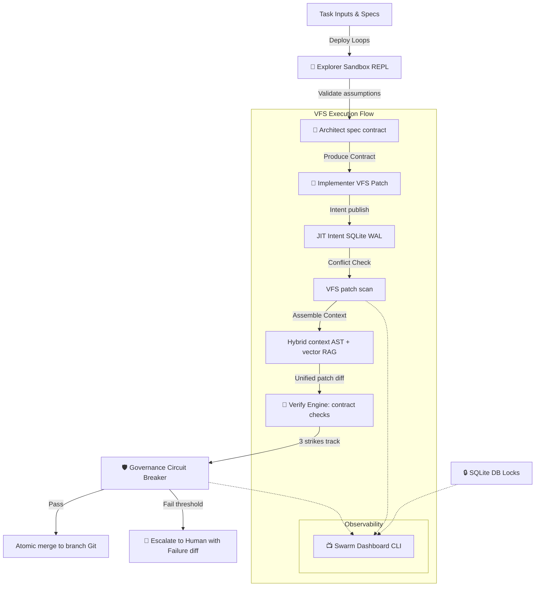

# Veyra OS V3 Context

Welcome to Veyra, the developer context hub. This document serves as the absolute source of truth for the codebase architecture, execution flow, and developer operations for the **Veyra OS V3** framework.

---

## 1. Project Purpose & Philosophy

Veyra is a reusable, AI-native engineering operating system repository framework designed to coordinate multiple AI-assisted developer agents in high-performance swarms while avoiding structural bottlenecks:
- **Contract-Proven Merges:** Programmatic checks (`bin/verify.js`) validate code properties against math/logical checklists prior to committing, preventing logic degradation.
- **Decoupled MCP Graph Memory:** Staging memory offloaded to an isolated Model Context Protocol (MCP) server running DuckDB and NetworkX to support large-scale clustering and history summarization.
- **Hybrid Context Assembly:** Combines local syntax-tree (AST) crawls with global similarity vector searches (RAG) to ensure maximum relevancy and zero token waste.
- **Explorer-Architect Prototyping Loops:** A fast *Explorer* sandbox tests assumptions before the *Architect* formalizes specs, mitigating waterfall friction.
- **Governance State-Machine Circuit Breakers:** Strict 3-strike retry bounds in `bin/governance.js` protect against infinite agent ping-pong loop token drain.
- **Swarm Telemetry Observability:** Swarm dashboard (`bin/dashboard.js`) rendering database locks, retry states, and active patch channels to display live swarm status.

---

## 2. Directory Structure & Map

- [bin/](file:///c:/Users/Vinyas%20G%20M/OneDrive/Desktop/veyra/bin) — CLI engine core.
  - [db.js](file:///c:/Users/Vinyas%20G%20M/OneDrive/Desktop/veyra/bin/db.js) — Memory cache with lazy-sync and timestamp checking.
  - [context.js](file:///c:/Users/Vinyas%20G%20M/OneDrive/Desktop/veyra/bin/context.js) — Hybrid context assembly engine (AST + semantic vector search).
  - [intent.js](file:///c:/Users/Vinyas%20G%20M/OneDrive/Desktop/veyra/bin/intent.js) — Ephemeral broadcast registry for style/API conflict isolation.
  - [patch.js](file:///c:/Users/Vinyas%20G%20M/OneDrive/Desktop/veyra/bin/patch.js) — Unified line-based and AST-based VFS patch engine.
  - [ast_transform.js](file:///c:/Users/Vinyas%20G%20M/OneDrive/Desktop/veyra/bin/ast_transform.js) — AST Code-as-a-Graph Transformation Engine.
  - [verify.js](file:///c:/Users/Vinyas%20G%20M/OneDrive/Desktop/veyra/bin/verify.js) — Formal contract and checklist validator.
  - [governance.js](file:///c:/Users/Vinyas%20G%20M/OneDrive/Desktop/veyra/bin/governance.js) — Multi-agent state tracker and circuit breaker.
  - [ui.js](file:///c:/Users/Vinyas%20G%20M/OneDrive/Desktop/veyra/bin/ui.js) — Procedural terminal double-bordered box, table, and progress bar layout styles.
  - [dashboard.js](file:///c:/Users/Vinyas%20G%20M/OneDrive/Desktop/veyra/bin/dashboard.js) — Telemetry extraction, metrics compilation, and visual rendering dashboard.
  - [router.js](file:///c:/Users/Vinyas%20G%20M/OneDrive/Desktop/veyra/bin/router.js) — Dual Explorer-Architect flow routing layer.
  - [veyra.js](file:///c:/Users/Vinyas%20G%20M/OneDrive/Desktop/veyra/bin/veyra.js) — CLI Entrypoint bootloader.
  - [visual-review.js](file:///c:/Users/Vinyas%20G%20M/OneDrive/Desktop/veyra/bin/visual-review.js) — Multimodal VLM responsive layout auditor.
- [memory-mcp-server/](file:///c:/Users/Vinyas%20G%20M/OneDrive/Desktop/veyra/memory-mcp-server) — MCP memory server running DuckDB + NetworkX graph operations.
- [agents/](file:///c:/Users/Vinyas%20G%20M/OneDrive/Desktop/veyra/agents) — Definitions for Orchestrator, Explorer, Architect, and Implementer roles.
- [checklists/](file:///c:/Users/Vinyas%20G%20M/OneDrive/Desktop/veyra/checklists) — JSON structured code contracts.
- [tests/](file:///c:/Users/Vinyas%20G%20M/OneDrive/Desktop/veyra/tests) — Regression Vitest suites.
  - [bin/visual-review.test.js](file:///c:/Users/Vinyas%20G%20M/OneDrive/Desktop/veyra/tests/bin/visual-review.test.js) — Unit/mock visual review runner test suite.
- [context/](file:///c:/Users/Vinyas%20G%20M/OneDrive/Desktop/veyra/context) — Generated context index outputs.
  - [tree.html](file:///c:/Users/Vinyas%20G%20M/OneDrive/Desktop/veyra/context/tree.html) — Collapsible D3.js interactive hierarchical file-to-symbol tree.
  - [graph.html](file:///c:/Users/Vinyas%20G%20M/OneDrive/Desktop/veyra/context/graph.html) — Collapsible Mermaid/D3.js callflow community-grouped architecture graph map.


---

## 3. Core Framework Flow



---

## 4. Operational Cheat Sheet

### Running Verification Tests
To run full regression Vitest checks:
```powershell
npm test
```

### Responsive Visual Layout Auditing
Execute responsive screenshots and visual alignment reviews:
```powershell
node bin/veyra.js visual-review
```

### Checking Contracts
Validating active VFS patches against a checklist contract:
```powershell
node bin/veyra.js verify check <patchFilePath> <contractFilePath>
```

### JIT Memory Graph Operations
Querying external MCP graph node dependencies:
```powershell
node bin/veyra.js memory query <nodeId>
```

### State Governance
Audit current circuit-breaker transition states:
```powershell
node bin/veyra.js governance status <transactionId>
```

### Launch Swarm Dashboard
Display database locks, retry strikes, and active patch channels visually:
```powershell
node bin/veyra.js dashboard
# OR
node bin/veyra.js ui dashboard
```

### Programmatic AST Transformation CLI
Modify file structure using TypeScript syntax AST engine:
```powershell
# Classes & Decorators
node bin/veyra.js ast apply <filePath> class <className> [isExported: true/false]
node bin/veyra.js ast apply <filePath> class-decorator <className> <decoratorName> [decoratorArgsJson]
node bin/veyra.js ast apply <filePath> class-method <className> <methodName> [paramsCommaSeparated] [methodBody] [decoratorsJson] [modifiersJson]
node bin/veyra.js ast apply <filePath> class-property <className> <propertyName> <propertyType> [initializerText] [decoratorsJson] [modifiersJson]

# JSX/TSX Markup
node bin/veyra.js ast apply <filePath> jsx-element <targetSelectorJson> <jsxString>
node bin/veyra.js ast apply <filePath> jsx-attribute <targetSelectorJson> <attrName> <attrValueExpression>

# Interfaces & Types
node bin/veyra.js ast apply <filePath> interface <interfaceName> [extendsNamesCommaSeparated]
node bin/veyra.js ast apply <filePath> interface-property <interfaceName> <propertyName> [isOptional: true/false] <propertyType>
node bin/veyra.js ast apply <filePath> type-alias <typeName> <typeValueText>
```

### JIT Context Indexing (with Graphify Enhancements)
Scan the repository structure, perform secrets/zip-bomb checks, and build static ASCII + D3 HTML trees and Mermaid flowcharts:
```powershell
node bin/veyra.js context index
```
Outputs:
- `context/repo-map.md`: Flat ASCII tree structure.
- `context/dependency-graph.md`: Module dependency matrix & Mermaid DAG.
- `context/tree.html`: Collapsible interactive D3.js filesystem tree.
- `context/graph.html`: Collapsible visual Mermaid callflow architecture map.

---

## 5. Graphify Visualizations Integration Details

The interactive HTML reports generated in the `context/` folder integrate with the codebase crawlers and the memory server to provide a visual interface for both human developers and agents:

### 5.1 Collapsible File-to-Symbol Tree (`context/tree.html`)
- **Structure:** Contains a self-contained HTML page embedding the D3.js library (v7) and a JSON representation of the file hierarchy.
- **Dynamic Behaviors:**
  - **Collapsible Nodes:** Clicking directory nodes toggles visibility of children using standard D3 node data manipulation (`d3.hierarchy` / transition animation).
  - **Symbol Display:** File leaf nodes are decorated with syntax-highlighted badges indicating class declarations, exported functions, and interface properties parsed by the AST system.
  - **Tooltips:** Hovering displays size on disk (bytes), line count (LOC), and last modified time.

### 5.2 Clustered Architecture Callflow Map (`context/graph.html`)
- **Structure:** Combines D3 force-directed nodes with Mermaid.js flowchart syntax to render modular coupling.
- **Community Clustering:** Node positions and border/background colors are bound to the Louvain modularity community IDs calculated by `memory-mcp-server/graph.py`.
- **Topological Highlighting:**
  - **God Nodes:** Highlighted with bright warning borders and larger radiuses proportional to their degree/PageRank centrality.
  - **Bridge Edges (Surprising Connections):** Rendered as thick, dashed lines in bright red. Indicates coupling across modular communities or programming languages.
- **Developer / Swarm Integration:** Developers can run `node bin/veyra.js context index` to refresh these maps instantly and review active workspaces via any standard web browser.
