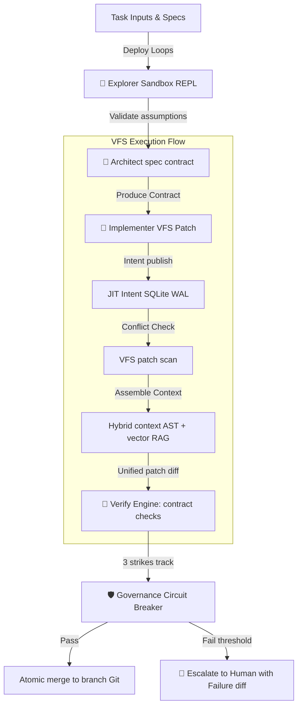

# Veyra OS V3 Context

Welcome to Veyra, the developer context hub. This document serves as the absolute source of truth for the codebase architecture, execution flow, and developer operations for the **Veyra OS V3** framework.

---

## 1. Project Purpose & Philosophy

Veyra is a reusable, AI-native engineering operating system repository framework designed to coordinate multiple AI-assisted developer agents in high-performance swarms while avoiding structural bottlenecks:
- **Contract-Proven Merges:** Programmatic checks (`bin/verify.js`) validate code properties against math/logical checklists prior to committing, preventing logic degradation.
- **Decoupled MCP Graph Memory:** Staging memory offloaded to an isolated Model Context Protocol (MCP) server running DuckDB and NetworkX to support large-scale clustering and history summarization.
- **Hybrid Context Assembly:** Combines local syntax-tree (AST) crawls with global similarity vector searches (RAG) to ensure maximum relevancy and zero token waste.
- **Explorer-Architect Prototyping Loops:** A fast *Explorer* sandbox tests assumptions before the *Architect* formalizes specs, mitigating waterfall friction.
- **Governance State-Machine Circuit Breakers:** Strict 3-strike retry bounds in `bin/governance.js` protect against infinite agent ping-pong loop token drain.

---

## 2. Directory Structure & Map

- [bin/](file:///c:/Users/Vinyas%20G%20M/OneDrive/Desktop/veyra/bin) — CLI engine core.
  - [db.js](file:///c:/Users/Vinyas%20G%20M/OneDrive/Desktop/veyra/bin/db.js) — Memory cache with lazy-sync and timestamp checking.
  - [context.js](file:///c:/Users/Vinyas%20G%20M/OneDrive/Desktop/veyra/bin/context.js) — Hybrid context assembly engine (AST + semantic vector search).
  - [intent.js](file:///c:/Users/Vinyas%20G%20M/OneDrive/Desktop/veyra/bin/intent.js) — Ephemeral broadcast registry for style/API conflict isolation.
  - [patch.js](file:///c:/Users/Vinyas%20G%20M/OneDrive/Desktop/veyra/bin/patch.js) — Unified line-based VFS patch dry-run applier.
  - [verify.js](file:///c:/Users/Vinyas%20G%20M/OneDrive/Desktop/veyra/bin/verify.js) — Formal contract and checklist validator.
  - [governance.js](file:///c:/Users/Vinyas%20G%20M/OneDrive/Desktop/veyra/bin/governance.js) — Multi-agent state tracker and circuit breaker.
  - [router.js](file:///c:/Users/Vinyas%20G%20M/OneDrive/Desktop/veyra/bin/router.js) — Dual Explorer-Architect flow routing layer.
  - [veyra.js](file:///c:/Users/Vinyas%20G%20M/OneDrive/Desktop/veyra/bin/veyra.js) — CLI Entrypoint bootloader.
- [memory-mcp-server/](file:///c:/Users/Vinyas%20G%20M/OneDrive/Desktop/veyra/memory-mcp-server) — MCP memory server running DuckDB + NetworkX graph operations.
- [agents/](file:///c:/Users/Vinyas%20G%20M/OneDrive/Desktop/veyra/agents) — Definitions for Orchestrator, Explorer, Architect, and Implementer roles.
- [checklists/](file:///c:/Users/Vinyas%20G%20M/OneDrive/Desktop/veyra/checklists) — JSON structured code contracts.
- [tests/](file:///c:/Users/Vinyas%20G%20M/OneDrive/Desktop/veyra/tests) — Regression Vitest suites.

---

## 3. Core Framework Flow



---

## 4. Operational Cheat Sheet

### Running Verification Tests
To run full regression Vitest checks:
```powershell
npm test
```

### Checking Contracts
Validating active VFS patches against a checklist contract:
```powershell
node bin/veyra.js verify check <patchFilePath> <contractFilePath>
```

### JIT Memory Graph Operations
Querying external MCP graph node dependencies:
```powershell
node bin/veyra.js memory query <nodeId>
```

### State Governance
Audit current circuit-breaker transition states:
```powershell
node bin/veyra.js governance status <transactionId>
```
