# Module Dependency Graph — Veyra OS

This document maps explicit module-level dependencies parsed directly from TypeScript/JavaScript import statements JIT.

## Dependency DAG Topology

```mermaid
graph TD
    _agents_teamwork_preview_explorer_dashboard_1_proposed_dashboard_test_js[".agents/teamwork_preview_explorer_dashboard_1/proposed_dashboard.test.js"] --> bin_dashboard_js["bin/dashboard.js"]
    _agents_teamwork_preview_explorer_dashboard_1_proposed_dashboard_test_js[".agents/teamwork_preview_explorer_dashboard_1/proposed_dashboard.test.js"] --> bin_db_js["bin/db.js"]
    bin_db_js["bin/db.js"] --> bin_schema_js["bin/schema.js"]
    bin_supervisor_js["bin/supervisor.js"] --> bin_skills_js["bin/skills.js"]
    bin_verify_js["bin/verify.js"] --> bin_patch_js["bin/patch.js"]
    bin_verify_js["bin/verify.js"] --> bin_context_js["bin/context.js"]
    bin_veyra_js["bin/veyra.js"] --> bin_db_js["bin/db.js"]
    bin_veyra_js["bin/veyra.js"] --> bin_context_js["bin/context.js"]
    bin_veyra_js["bin/veyra.js"] --> bin_intent_js["bin/intent.js"]
    bin_veyra_js["bin/veyra.js"] --> bin_patch_js["bin/patch.js"]
    bin_veyra_js["bin/veyra.js"] --> bin_verify_js["bin/verify.js"]
    bin_veyra_js["bin/veyra.js"] --> bin_governance_js["bin/governance.js"]
    bin_veyra_js["bin/veyra.js"] --> bin_dashboard_js["bin/dashboard.js"]
    bin_veyra_js["bin/veyra.js"] --> bin_visual_review_js["bin/visual-review.js"]
    bin_veyra_js["bin/veyra.js"] --> bin_linter_js["bin/linter.js"]
    bin_veyra_js["bin/veyra.js"] --> bin_ast_transform_js["bin/ast_transform.js"]
    bin_veyra_js["bin/veyra.js"] --> bin_event_bus_js["bin/event_bus.js"]
    bin_workflow_js["bin/workflow.js"] --> bin_supervisor_js["bin/supervisor.js"]
    tests_bin_dashboard_stress_test_js["tests/bin/dashboard-stress.test.js"] --> bin_dashboard_js["bin/dashboard.js"]
    tests_bin_dashboard_stress_test_js["tests/bin/dashboard-stress.test.js"] --> bin_db_js["bin/db.js"]
    tests_bin_dashboard_test_js["tests/bin/dashboard.test.js"] --> bin_dashboard_js["bin/dashboard.js"]
    tests_bin_dashboard_test_js["tests/bin/dashboard.test.js"] --> bin_db_js["bin/db.js"]
    tests_bin_governance_test_js["tests/bin/governance.test.js"] --> bin_governance_js["bin/governance.js"]
    tests_bin_schema_test_js["tests/bin/schema.test.js"] --> bin_schema_js["bin/schema.js"]
    tests_bin_verify_test_js["tests/bin/verify.test.js"] --> bin_verify_js["bin/verify.js"]
    tests_bin_verify_test_js["tests/bin/verify.test.js"] --> bin_patch_js["bin/patch.js"]
```

## Dependency Matrix Table
| Module | Depends On | Depended By |
| :--- | :--- | :--- |
| `.agents/teamwork_preview_explorer_dashboard_1/proposed_dashboard.js` | *None* | *None* |
| `.agents/teamwork_preview_explorer_dashboard_1/proposed_dashboard.test.js` | `bin/dashboard.js`, `bin/db.js` | *None* |
| `bin/ast_transform.js` | *None* | `bin/veyra.js` |
| `bin/context.js` | *None* | `bin/verify.js`, `bin/veyra.js` |
| `bin/dashboard.js` | *None* | `.agents/teamwork_preview_explorer_dashboard_1/proposed_dashboard.test.js`, `bin/veyra.js`, `tests/bin/dashboard-stress.test.js`, `tests/bin/dashboard.test.js` |
| `bin/db.js` | `bin/schema.js` | `.agents/teamwork_preview_explorer_dashboard_1/proposed_dashboard.test.js`, `bin/veyra.js`, `tests/bin/dashboard-stress.test.js`, `tests/bin/dashboard.test.js` |
| `bin/event_bus.js` | *None* | `bin/veyra.js` |
| `bin/governance.js` | *None* | `bin/veyra.js`, `tests/bin/governance.test.js` |
| `bin/intent.js` | *None* | `bin/veyra.js` |
| `bin/linter.js` | *None* | `bin/veyra.js` |
| `bin/patch.js` | *None* | `bin/verify.js`, `bin/veyra.js`, `tests/bin/verify.test.js` |
| `bin/router.js` | *None* | *None* |
| `bin/schema.js` | *None* | `bin/db.js`, `tests/bin/schema.test.js` |
| `bin/skills.js` | *None* | `bin/supervisor.js` |
| `bin/supervisor.js` | `bin/skills.js` | `bin/workflow.js` |
| `bin/ui.js` | *None* | *None* |
| `bin/verify.js` | `bin/patch.js`, `bin/context.js` | `bin/veyra.js`, `tests/bin/verify.test.js` |
| `bin/veyra.js` | `bin/db.js`, `bin/context.js`, `bin/intent.js`, `bin/patch.js`, `bin/verify.js`, `bin/governance.js`, `bin/dashboard.js`, `bin/visual-review.js`, `bin/linter.js`, `bin/ast_transform.js`, `bin/event_bus.js` | *None* |
| `bin/visual-review.js` | *None* | `bin/veyra.js` |
| `bin/workflow.js` | `bin/supervisor.js` | *None* |
| `bin/worktree.js` | *None* | *None* |
| `demo-ast-patching.js` | *None* | *None* |
| `tests/bin/ast-transform.test.js` | *None* | *None* |
| `tests/bin/context.test.js` | *None* | *None* |
| `tests/bin/dashboard-stress.test.js` | `bin/dashboard.js`, `bin/db.js` | *None* |
| `tests/bin/dashboard.test.js` | `bin/dashboard.js`, `bin/db.js` | *None* |
| `tests/bin/db.test.js` | *None* | *None* |
| `tests/bin/event-bus.test.js` | *None* | *None* |
| `tests/bin/governance.test.js` | `bin/governance.js` | *None* |
| `tests/bin/intent.test.js` | *None* | *None* |
| `tests/bin/patch.test.js` | *None* | *None* |
| `tests/bin/router.test.js` | *None* | *None* |
| `tests/bin/schema.test.js` | `bin/schema.js` | *None* |
| `tests/bin/task-queue.test.js` | *None* | *None* |
| `tests/bin/ui.test.js` | *None* | *None* |
| `tests/bin/verify.test.js` | `bin/verify.js`, `bin/patch.js` | *None* |
| `tests/bin/visual-review.test.js` | *None* | *None* |
| `tests/bin/worktree.test.js` | *None* | *None* |
| `vitest.config.js` | *None* | *None* |

*Indexed at: 2026-06-07T18:01:27.208Z*
