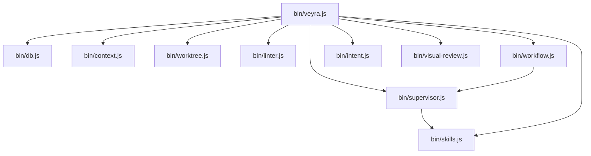

# Module Dependency Graph — Veyra OS

This document maps explicit module-level dependencies parsed directly from TypeScript/JavaScript import statements JIT.

## Dependency DAG Topology

## Dependency Matrix Table
| Module | Depends On | Depended By |
| :--- | :--- | :--- |
| `bin/context.js` | *None* | `bin/veyra.js` |
| `bin/db.js` | *None* | `bin/veyra.js` |
| `bin/intent.js` | *None* | `bin/veyra.js` |
| `bin/linter.js` | *None* | `bin/veyra.js` |
| `bin/skills.js` | *None* | `bin/supervisor.js`, `bin/veyra.js` |
| `bin/supervisor.js` | `bin/skills.js` | `bin/veyra.js`, `bin/workflow.js` |
| `bin/veyra.js` | `bin/db.js`, `bin/context.js`, `bin/worktree.js`, `bin/linter.js`, `bin/supervisor.js`, `bin/skills.js`, `bin/workflow.js`, `bin/intent.js`, `bin/visual-review.js` | *None* |
| `bin/visual-review.js` | *None* | `bin/veyra.js` |
| `bin/workflow.js` | `bin/supervisor.js` | `bin/veyra.js` |
| `bin/worktree.js` | *None* | `bin/veyra.js` |
| `create_all.js` | *None* | *None* |

*Indexed at: 2026-05-25T14:55:03.276Z*
