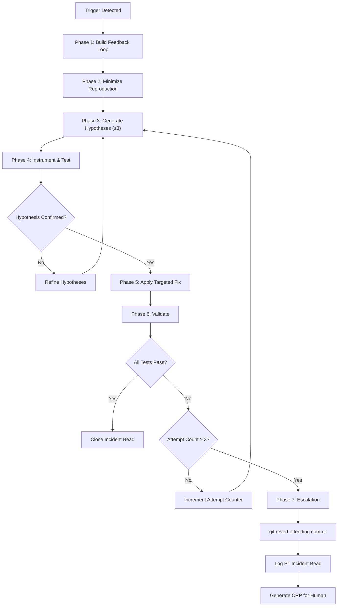

# Autonomous Debugging Framework

This directory contains the debugging discipline for Veyra agents. Every bug is treated as an evidence-collection problem, not a guessing game.

---

## Triggers

An agent enters the debugging loop when any of these conditions occur:

| Trigger | Source | Entry Point |
| :--- | :--- | :--- |
| CI/CD pipeline failure | GitHub Actions / CI runner | Automated — agent reads failure logs |
| Test regression | `pnpm vitest run` reports new failures | Automated — agent diffs test results against last green run |
| Runtime anomaly | Health check endpoint returns non-200 | Automated — monitoring agent escalates |
| Human-reported bug | CRP or bead with `type: bug` | Manual — agent picks up from bead queue |

---

## Core Principle

**Evidence-backed root cause isolation.** Never apply speculative fixes. Never change code without a falsifiable hypothesis and a reproducible failing signal.

The debugging skill is NOT "fixing bugs." The debugging skill is **building a feedback loop that makes the bug's cause mechanically obvious.**

---

## Rollback Policy

| Condition | Action |
| :--- | :--- |
| Fix attempt 1 fails | Re-examine hypotheses, re-instrument |
| Fix attempt 2 fails | Expand hypothesis set, add deeper tracing |
| Fix attempt 3 fails | `git revert` the offending commit immediately |

After a rollback:
1. Log a **high-severity incident bead** (`P1` minimum) using [incident-template.md](./incident-template.md)
2. Generate a **CRP (Change Request Proposal)** for human review containing: stack trace, all hypotheses tested, all evidence collected
3. Mark the bead status as `escalated`

---

## Debugging Loop

---

## Directory Contents

| File | Purpose |
| :--- | :--- |
| [README.md](./README.md) | This file — framework overview |
| [root-cause-loop.md](./root-cause-loop.md) | Detailed 7-phase debugging discipline |
| [incident-template.md](./incident-template.md) | Structured incident report template |

---

## Key Rules

1. **No blind patches.** Every code change must trace to a confirmed hypothesis with supporting evidence.
2. **Feedback loop first.** If you don't have a reproducible pass/fail signal, you are not debugging — you are guessing.
3. **Regression test before fix.** Write the test that catches the bug BEFORE writing the fix.
4. **Minimal surface area.** Touch only the code required to fix the confirmed root cause. Do not "improve" adjacent code.
5. **Evidence in beads.** Every incident bead must contain test output, stack traces, and hypothesis results — not just descriptions.
