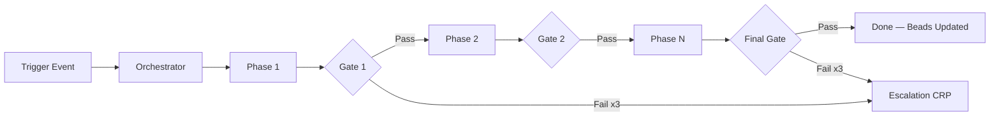

# Workflows

This directory contains declarative workflow definitions that the orchestrator agent uses to coordinate multi-agent task execution. Each workflow is a YAML file describing phases, agent assignments, quality gates, and escalation paths.

## How Workflows Execute

1. A **trigger event** activates the workflow (e.g., an approved spec, a CI failure, a new dependency).
2. The **orchestrator** reads the workflow YAML and creates task beads for each phase.
3. Each phase runs with its assigned **agent(s)**, consuming defined inputs and producing defined outputs.
4. A phase does NOT proceed to the next until all **quality gates** pass.
5. If a gate fails after the maximum retry count, the workflow triggers its **escalation path** (usually a CRP — Consultation Request Pack).

## Available Workflows

| Workflow | File | Trigger | Agents Involved | Quality Gates | Output |
|:---|:---|:---|:---|:---|:---|
| **Feature Development** | [feature-development.yaml](./feature-development.yaml) | Approved Epic or Feature Specification | planner, orchestrator, backend-engineer, frontend-engineer, code-reviewer, security-reviewer | Human approval of SPEC, no circular deps, tests passing, lint clean, code review approved, no critical security findings, CI green | Merged feature on main branch |
| **Bug Fixing** | [bug-fixing.yaml](./bug-fixing.yaml) | Issue bead creation or CI failure | debugging-specialist, testing-engineer | Reproduction confirmed, ≥3 hypotheses generated, previously-failing test now passes, no new regressions | Patched code with regression test |
| **Refactoring** | [refactoring.yaml](./refactoring.yaml) | Technical debt threshold crossed | architect, backend-engineer or frontend-engineer | Code smells documented, test suite unchanged post-refactor, cyclomatic complexity reduced | Cleaner codebase with identical behavior |
| **Test Generation** | [testing-generation.yaml](./testing-generation.yaml) | Uncovered code merged to main | testing-engineer | All execution paths identified, mocks are minimal and boundary-focused, 80%+ branch coverage achieved | Test files with comprehensive coverage |
| **Documentation Generation** | [documentation-generation.yaml](./documentation-generation.yaml) | Feature merge to main | documentation-writer | Accurate reflection of current code, all public APIs documented, no stale references | Updated markdown documentation |
| **Security Audit** | [security-audit.yaml](./security-audit.yaml) | New dependency added or scheduled cron | security-reviewer | Zero high/critical CVEs, no secrets in codebase, threat model reviewed | Security audit report |

## Workflow Lifecycle Diagram

## Conventions

- **Phases are sequential** unless explicitly marked with `parallel: true`.
- **Gates are blocking** — the workflow halts until the gate passes or escalation fires.
- **Every workflow updates bead status** on completion (`open` → `resolved` or `blocked`).
- **Escalation always produces a CRP** using the [CRP template](../templates/CRP.md).
